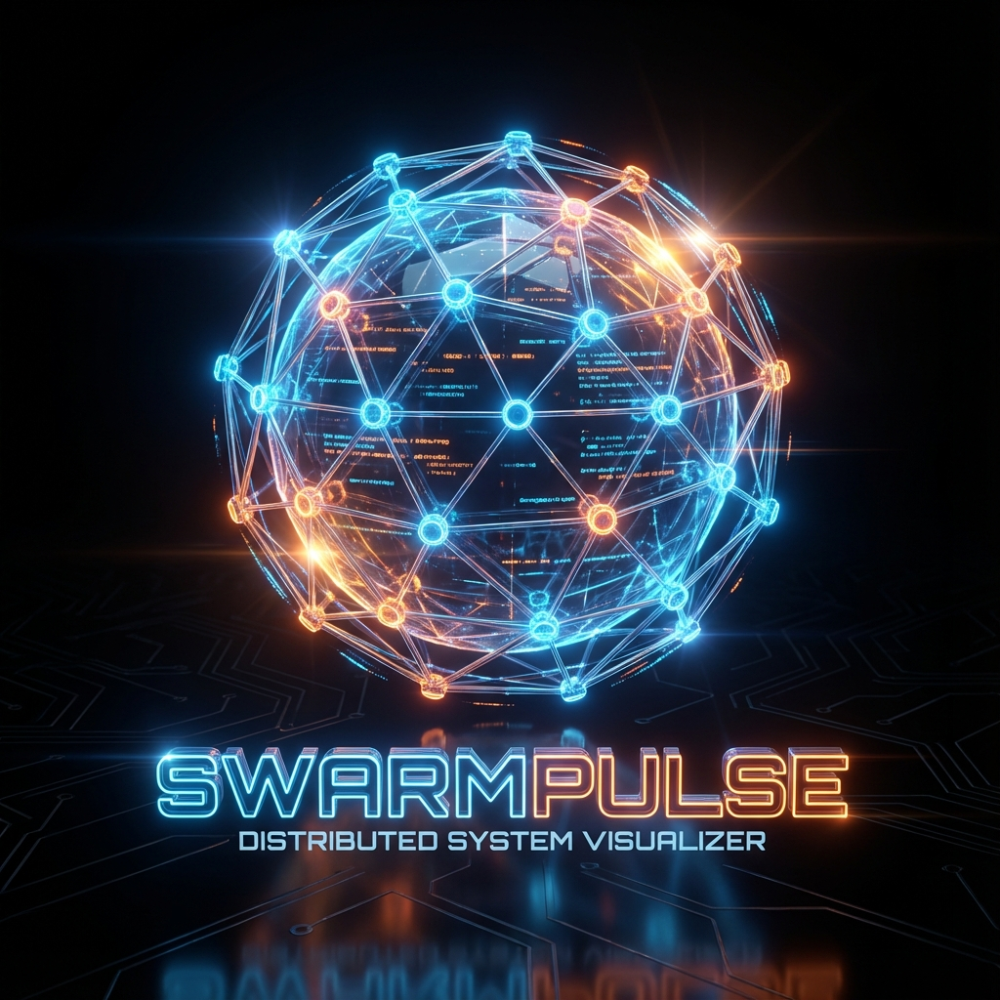
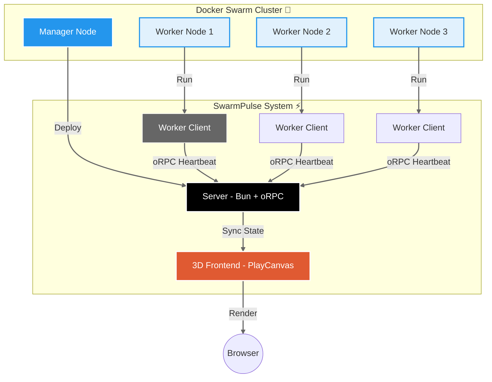

<div align="center">



# SwarmPulse 3D 🌐

**Docker Swarm 分散式 3D 視覺化監控系統**


[快速開始](#-快速開始) • [部署指南](#-docker-swarm-部署) • [3D 操作](#-3d-操作說明)

</div>

---

## 📖 簡介

**SwarmPulse 3D** 將看不見的基礎設施狀態轉化為令人驚嘆的 **3D 數位孿生 (Digital Twin)** 場景。

在這個虛擬的控制中心裡，每一個 Docker Swarm 節點都化身為一顆充滿能量的發光球體。透過 **Bun** 與 **oRPC** 的高速通訊，以及 **PlayCanvas** 的強大渲染能力，我們能即時看見整個叢集的生命力。

### 🔥 視覺化亮點

| 狀態變化 | 3D 視覺反饋 | 效果說明 |
| :--- | :--- | :--- |
| **CPU 負載升高** | 🔄 **極速旋轉** | 能量球自轉速度隨 CPU 使用率線性增加 |
| **記憶體佔用增加** | 💡 **高亮發光** | 當記憶體吃緊時，球體會發出耀眼警示光芒 |
| **新節點加入** | ✨ **誕生動畫** | 伴隨著光效從中心點生成並放大 |
| **節點離線/崩潰** | 💥 **爆炸消散** | 失去心跳的節點會粒子化並消散於虛空 |

---

## 🏗️ 系統架構



---

## 🚀 快速開始

### 前置需求

- [Bun](https://bun.sh/) 1.0+
- [Docker](https://www.docker.com/) 24.0+ (可選，用於容器部署)

### 本地開發

只需要三個簡單步驟，即可在本地啟動您的 3D 監控中心：

```bash
# 1. 安裝依賴
bun install

# 2. 啟動 Server（建議開啟新終端機）
bun run server

# 3. 啟動 Client（可在不同終端機啟動多個以模擬叢集）
bun run client

# 4. 前往瀏覽器體驗
open http://localhost:3000
```

---

## 🐳 Docker Swarm 部署

SwarmPulse 專為 Swarm 環境設計，部署只需一行指令。

### 1. 初始化 Swarm (如果尚未初始化)

```bash
docker swarm init
```

### 2. 部署 Stack

```bash
# 建置映像
docker compose build

# 部署服務到叢集
docker stack deploy -c docker-compose.yml swarmpulse
```

> **提示**: 部署後，Worker Client 會自動分散到各個節點，並透過 Docker Internal DNS 自動尋找 Server。

### 3. 查看狀態

```bash
docker service logs swarmpulse_server -f
open http://localhost:3000
```

---

## 🎮 3D 操作說明

化身為指揮官，自由探索您的數位叢集：

| 操作方式 | 動作效果 |
| :--- | :--- |
| **滑鼠左鍵拖曳** | 🔄 360度環繞旋轉視角 |
| **滑鼠滾輪** | 🔍 縮放視角（Zoom In/Out） |
| **觸控滑動** | 📱 在行動裝置上旋轉視角 |
| **雙指縮放** | 🤏 在行動裝置上縮放 |

---

## 📁 專案結構

```
swarmpulse/
├── src/
│   ├── contract.ts       # 📜 oRPC 契約 (Zod Schemas)
│   ├── server.ts         # 🧠 核心伺服器 (狀態管理)
│   └── client.ts         # 📡 邊緣採集器 (系統監控)
├── public/
│   ├── index.html        # 🚪 3D 入口
│   └── game.js           # 🎨 PlayCanvas 渲染邏輯
├── Dockerfile            # 📦 統一建置檔
└── docker-compose.yml    # ☸️ 編排配置
```

---

## 🎯 互動挑戰

試試看這些操作，體驗 SwarmPulse 的即時反應：

1.  **壓力測試 (CPU)**：在 Worker 節點執行 `stress-ng --cpu 4`，看著那顆能量球瘋狂旋轉！
2.  **記憶體測試**：執行 `stress-ng --vm 1 --vm-bytes 1G`，觀察球體亮度爆表。
3.  **大屠殺**：隨機 `docker kill` 幾個 Client 容器，欣賞壯觀的粒子消散秀。

---

## 📄 授權

MIT License © 2025 SwarmPulse Team
