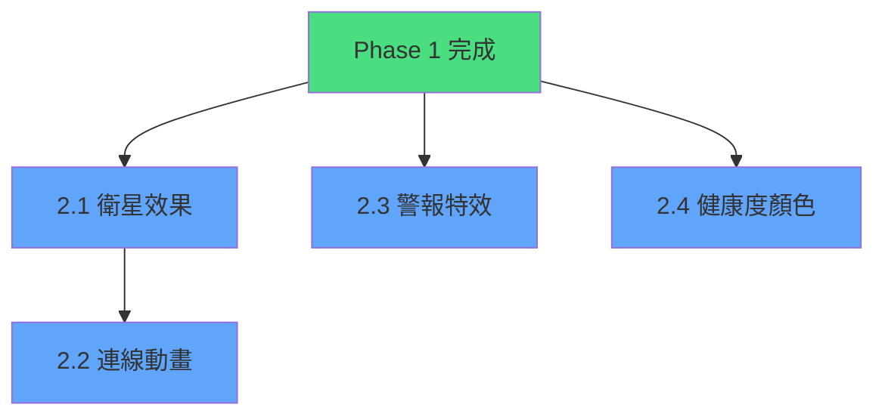

# Phase 2: 視覺效果升級 - 詳細實作計畫

> **階段目標**: 提升視覺震撼力與資訊可讀性，以豐富的視覺效果呈現叢集狀態

**文件建立日期**: 2026-01-01  
**最後更新日期**: 2026-01-01  
**實際完成日期**: 2026-01-01  
**預估總工時**: 17 小時

---

## 📋 功能總覽

| # | 功能 | 優先級 | 預估工時 | 狀態 | 相依性 |
|:---:|:---|:---:|:---:|:---:|:---|
| 2.1 | Container 衛星效果 | P1 | 5h | ✅ | Phase 1 完成 |
| 2.2 | Manager-Worker 連線動畫 | P1 | 6h | ✅ | 2.1 完成 |
| 2.3 | 異常警報特效 | P2 | 4h | ✅ | 無 |
| 2.4 | 節點健康度顏色漸變 | P2 | 2h | ✅ | 無 |

---

## 2.1 Container 衛星效果

### 功能描述
依據節點上運行的 Container 數量，在星球周圍顯示小衛星繞行，直覺呈現每個節點上的服務數量。

### 視覺設計

```
                    ○ (衛星 1)
            🔮       
         ●────────○ (衛星 2)
      (節點)
            ○ (衛星 3)
            
衛星特性：
- 小球體，發光材質
- 繞行軌道半徑 = 節點大小 × 1.5
- 繞行速度 = 每衛星有獨立相位
- 顏色 = 根據 Container 狀態
```

### 技術實作步驟

---

#### Step 1: 修改 Client 回報 Container 數量

##### [MODIFY] [contract.ts](file:///home/raybird/Documents/RCodes/swarmpulse/src/contract.ts)

目前 Schema 已包含 `containers` 欄位，無需修改。確認 Client 正確回報即可。

##### [MODIFY] [client.ts](file:///home/raybird/Documents/RCodes/swarmpulse/src/client.ts)

確認 `getContainerList()` 函數正常運作，回報 Container 數量。

---

#### Step 2: 建立衛星模型與材質

##### [MODIFY] [game.js](file:///home/raybird/Documents/RCodes/swarmpulse/public/game.js)

**新增 CONFIG 常數**:
```javascript
// 衛星配置
SATELLITE_SIZE: 0.15,           // 衛星大小
SATELLITE_ORBIT_RADIUS: 1.5,    // 軌道半徑倍數
SATELLITE_SPEED: 0.5,           // 基礎繞行速度
SATELLITE_MAX_COUNT: 10,        // 最大顯示衛星數
```

**新增 createSatellite 函數**:
```javascript
function createSatellite(parent, index, total) {
    const satellite = new pc.Entity('satellite-' + index);
    
    // 球體渲染
    satellite.addComponent('render', {
        type: 'sphere',
        material: createSatelliteMaterial()
    });
    
    satellite.setLocalScale(
        CONFIG.SATELLITE_SIZE,
        CONFIG.SATELLITE_SIZE,
        CONFIG.SATELLITE_SIZE
    );
    
    // 儲存軌道資訊
    satellite.orbitIndex = index;
    satellite.orbitTotal = total;
    satellite.orbitPhase = (index / total) * Math.PI * 2;
    
    parent.addChild(satellite);
    return satellite;
}
```

**新增 createSatelliteMaterial 函數**:
```javascript
function createSatelliteMaterial() {
    const material = new pc.StandardMaterial();
    material.diffuse = new pc.Color(0.3, 0.8, 1.0);
    material.emissive = new pc.Color(0.1, 0.4, 0.8);
    material.metalness = 0.6;
    material.gloss = 0.9;
    material.update();
    return material;
}
```

---

#### Step 3: 衛星軌道動畫邏輯

##### [MODIFY] [game.js](file:///home/raybird/Documents/RCodes/swarmpulse/public/game.js)

**新增 updateSatelliteOrbit 函數**:
```javascript
function updateSatelliteOrbit(satellite, dt, parentRadius) {
    const orbitRadius = parentRadius * CONFIG.SATELLITE_ORBIT_RADIUS;
    satellite.orbitPhase += CONFIG.SATELLITE_SPEED * dt;
    
    // 橢圓軌道 (增加視覺趣味性)
    const x = Math.cos(satellite.orbitPhase) * orbitRadius;
    const z = Math.sin(satellite.orbitPhase) * orbitRadius * 0.7;
    const y = Math.sin(satellite.orbitPhase * 2) * 0.2;
    
    satellite.setLocalPosition(x, y, z);
}
```

**修改 setupUpdateLoop 函數**，加入衛星動畫更新：
```javascript
// 在 app.on('update') 內加入
for (const [nodeId, nodeData] of nodeEntities) {
    if (nodeData.satellites) {
        for (const sat of nodeData.satellites) {
            updateSatelliteOrbit(sat, dt, nodeData.radius);
        }
    }
}
```

---

#### Step 4: 衛星動態增減

**新增 updateNodeSatellites 函數**:
```javascript
function updateNodeSatellites(nodeData, containerCount) {
    const targetCount = Math.min(containerCount, CONFIG.SATELLITE_MAX_COUNT);
    const currentCount = (nodeData.satellites || []).length;
    
    if (targetCount > currentCount) {
        // 新增衛星（帶出現動畫）
        for (let i = currentCount; i < targetCount; i++) {
            const sat = createSatellite(nodeData.entity, i, targetCount);
            sat.setLocalScale(0, 0, 0);
            animateSatelliteAppear(sat);
            nodeData.satellites = nodeData.satellites || [];
            nodeData.satellites.push(sat);
        }
    } else if (targetCount < currentCount) {
        // 移除衛星（帶消失動畫）
        for (let i = currentCount - 1; i >= targetCount; i--) {
            animateSatelliteDisappear(nodeData.satellites[i]);
            nodeData.satellites.pop();
        }
    }
}
```

---

### 驗證方式

> [!NOTE]
> Container 衛星效果需要在節點有運行 Container 的情況下才能觀察到。

#### 自動化測試
- 無法自動化測試 3D 視覺效果

#### 手動驗證步驟
1. 啟動 Docker Swarm 叢集並運行數個 Container
2. 啟動 SwarmPulse Server：`npm run server`
3. 開啟瀏覽器至 `http://localhost:3000`
4. 驗證：
   - [x] 有 Container 的節點周圍出現小衛星
   - [x] 衛星數量與 Container 數量相符（最多 10 個）
   - [x] 衛星平滑繞行星球
   - [x] Container 增減時衛星有出現/消失動畫

---

## 2.2 Manager-Worker 連線動畫

### 功能描述
在 Manager 與 Worker 之間繪製連線，資料傳輸時有光點流動效果，視覺化呈現叢集拓撲結構。

### 視覺設計

```
        ★ Manager
       /|\
      / | \
     /  |  \
    ●   ●   ●  Workers
    
連線特性：
- 半透明藍色線條
- 光點從 Worker 流向 Manager（代表心跳）
- Manager 節點有特殊星形標記
```

### 技術實作步驟

---

#### Step 1: 擴充節點類型資訊

##### [MODIFY] [contract.ts](file:///home/raybird/Documents/RCodes/swarmpulse/src/contract.ts)

目前 Schema 已包含 `role` 欄位（`'manager' | 'worker'`），無需修改。

##### [MODIFY] [client.ts](file:///home/raybird/Documents/RCodes/swarmpulse/src/client.ts)

**修改 getNodeState 函數**，加入節點角色偵測：
```typescript
async function getSwarmRole(): Promise<'manager' | 'worker' | undefined> {
    try {
        const { stdout } = await execAsync('docker info --format "{{.Swarm.ControlAvailable}}"');
        return stdout.trim() === 'true' ? 'manager' : 'worker';
    } catch {
        return undefined;
    }
}
```

---

#### Step 2: Manager 節點特殊造型

##### [MODIFY] [game.js](file:///home/raybird/Documents/RCodes/swarmpulse/public/game.js)

**修改 createNodeEntity 函數**:
```javascript
function createNodeEntity(nodeState, index, totalNodes) {
    // ... 現有程式碼 ...
    
    // Manager 節點加入皇冠/星形標記
    if (nodeState.role === 'manager') {
        const crown = createManagerCrown();
        entity.addChild(crown);
        nodeData.crown = crown;
    }
}
```

**新增 createManagerCrown 函數**:
```javascript
function createManagerCrown() {
    const crown = new pc.Entity('manager-crown');
    
    // 使用多個小球體組成星形
    const starPoints = 5;
    for (let i = 0; i < starPoints; i++) {
        const point = new pc.Entity('crown-point-' + i);
        point.addComponent('render', {
            type: 'sphere',
            material: createCrownMaterial()
        });
        point.setLocalScale(0.1, 0.1, 0.1);
        
        const angle = (i / starPoints) * Math.PI * 2;
        const radius = 0.6;
        point.setLocalPosition(
            Math.cos(angle) * radius,
            0.8,
            Math.sin(angle) * radius
        );
        
        crown.addChild(point);
    }
    
    return crown;
}
```

---

#### Step 3: 繪製節點間連線

**新增 CONFIG 常數**:
```javascript
CONNECTION_COLOR: new pc.Color(0.2, 0.5, 1.0, 0.3), // 半透明藍色
CONNECTION_WIDTH: 2,
DATA_PARTICLE_SPEED: 2.0,
DATA_PARTICLE_COLOR: new pc.Color(0.4, 0.8, 1.0)
```

**新增 createConnectionLine 函數**:
```javascript
// 連線管理
const connectionLines = new Map(); // key: "managerId-workerId"

function createConnectionLine(managerEntity, workerEntity, managerId, workerId) {
    const key = `${managerId}-${workerId}`;
    
    // 使用 Line 幾何體
    const lineEntity = new pc.Entity('connection-' + key);
    
    // 建立動態線條（需要每幀更新頂點）
    const mesh = createLineMesh(
        managerEntity.getPosition(),
        workerEntity.getPosition()
    );
    
    lineEntity.addComponent('render', {
        type: 'asset',
        meshInstances: [new pc.MeshInstance(mesh, createLineMaterial())]
    });
    
    app.root.addChild(lineEntity);
    
    connectionLines.set(key, {
        entity: lineEntity,
        mesh: mesh,
        managerId: managerId,
        workerId: workerId,
        particles: []
    });
}
```

---

#### Step 4: 光點流動粒子效果

**新增 DataParticle 類別**:
```javascript
class DataParticle {
    constructor(startPos, endPos) {
        this.entity = new pc.Entity('data-particle');
        this.entity.addComponent('render', {
            type: 'sphere',
            material: createParticleMaterial()
        });
        this.entity.setLocalScale(0.05, 0.05, 0.05);
        
        this.startPos = startPos.clone();
        this.endPos = endPos.clone();
        this.progress = 0;
        
        app.root.addChild(this.entity);
    }
    
    update(dt) {
        this.progress += dt * CONFIG.DATA_PARTICLE_SPEED;
        
        if (this.progress >= 1) {
            this.destroy();
            return false;
        }
        
        // 平滑插值位置
        const pos = new pc.Vec3().lerp(
            this.startPos,
            this.endPos,
            this.progress
        );
        this.entity.setPosition(pos);
        
        return true;
    }
    
    destroy() {
        this.entity.destroy();
    }
}
```

**修改 updateNodeState 函數**，在收到心跳時觸發粒子：
```javascript
function updateNodeState(nodeData, newState) {
    // ... 現有程式碼 ...
    
    // 觸發心跳粒子效果
    if (newState.role === 'worker') {
        spawnHeartbeatParticle(nodeData);
    }
}
```

---

### 驗證方式

#### 手動驗證步驟
1. 確保 Swarm 叢集包含 1 個 Manager + 至少 2 個 Worker
2. 啟動 SwarmPulse：`npm run server`
3. 開啟瀏覽器至 `http://localhost:3000`
4. 驗證：
   - [x] Manager 節點有明顯的星形/皇冠標記
   - [x] Manager 與每個 Worker 之間有連線
   - [x] 心跳時可見光點從 Worker 流向 Manager
   - [x] 連線顏色為半透明藍色

---

## 2.3 異常警報特效

### 功能描述
當 CPU/Memory 超過閾值，星球開始冒火焰/警報粒子效果，提供即時的視覺警示。

### 視覺設計

```
        🔥🔥🔥
      🔥 ● 🔥   CPU > 80%
        🔥🔥🔥
        
警報等級：
- 警告 (> 70%): 橘色光環脈動
- 危險 (> 85%): 紅色火焰粒子
- 緊急 (> 95%): 強烈紅色閃爍 + 震動
```

### 技術實作步驟

---

#### Step 1: 定義警報閾值（可配置）

##### [MODIFY] [game.js](file:///home/raybird/Documents/RCodes/swarmpulse/public/game.js)

**新增 CONFIG 常數**:
```javascript
// 警報閾值配置
ALERT_THRESHOLDS: {
    warning: 70,    // 橘色警告
    danger: 85,     // 紅色危險
    critical: 95    // 緊急
},
ALERT_COLORS: {
    warning: new pc.Color(1.0, 0.6, 0.0),  // 橘色
    danger: new pc.Color(1.0, 0.2, 0.0),   // 紅色
    critical: new pc.Color(1.0, 0.0, 0.0)  // 深紅
}
```

---

#### Step 2: 建立警報粒子系統

**新增 createAlertParticleSystem 函數**:
```javascript
function createAlertParticleSystem(parentEntity, level) {
    const particleSystem = new pc.Entity('alert-particles');
    
    // PlayCanvas 粒子系統設定
    particleSystem.addComponent('particlesystem', {
        numParticles: level === 'critical' ? 50 : 30,
        lifetime: 1.0,
        rate: 20,
        startAngle: 0,
        startAngle2: 360,
        emitterShape: pc.EMITTERSHAPE_SPHERE,
        emitterRadius: 0.5,
        velocityGraph: new pc.CurveSet([
            [0, 0], [1, 0],
            [0, 2], [1, 0],
            [0, 0], [1, 0]
        ]),
        colorGraph: new pc.CurveSet([
            [0, 1], [0.5, 1], [1, 0],
            [0, 0.5], [0.5, 0], [1, 0],
            [0, 0], [0.5, 0], [1, 0]
        ]),
        scaleGraph: new pc.Curve([0, 0.1, 0.3, 0.2, 1, 0])
    });
    
    parentEntity.addChild(particleSystem);
    return particleSystem;
}
```

---

#### Step 3: 閾值判斷與效果觸發

**新增 checkAlertStatus 函數**:
```javascript
function checkAlertStatus(nodeData, nodeState) {
    const maxUsage = Math.max(nodeState.cpuUsage, nodeState.memoryUsage);
    let level = null;
    
    if (maxUsage >= CONFIG.ALERT_THRESHOLDS.critical) {
        level = 'critical';
    } else if (maxUsage >= CONFIG.ALERT_THRESHOLDS.danger) {
        level = 'danger';
    } else if (maxUsage >= CONFIG.ALERT_THRESHOLDS.warning) {
        level = 'warning';
    }
    
    updateAlertEffect(nodeData, level);
}
```

**新增 updateAlertEffect 函數**:
```javascript
function updateAlertEffect(nodeData, level) {
    const currentLevel = nodeData.alertLevel;
    
    if (level === currentLevel) return;
    
    // 移除現有效果
    if (nodeData.alertParticles) {
        nodeData.alertParticles.destroy();
        nodeData.alertParticles = null;
    }
    
    // 建立新效果
    if (level) {
        nodeData.alertParticles = createAlertParticleSystem(
            nodeData.entity,
            level
        );
        
        // 緊急等級加入震動
        if (level === 'critical') {
            nodeData.shaking = true;
        }
    } else {
        nodeData.shaking = false;
    }
    
    nodeData.alertLevel = level;
}
```

---

#### Step 4: 震動動畫（緊急等級）

**修改 setupUpdateLoop**：
```javascript
// 在 update 迴圈中加入震動邏輯
for (const [nodeId, nodeData] of nodeEntities) {
    if (nodeData.shaking) {
        const shake = Math.sin(Date.now() * 0.05) * 0.02;
        const pos = nodeData.originalPosition || nodeData.entity.getPosition().clone();
        nodeData.originalPosition = pos;
        nodeData.entity.setPosition(
            pos.x + shake,
            pos.y + shake * 0.5,
            pos.z + shake
        );
    }
}
```

---

### 驗證方式

#### 手動驗證步驟
1. 在測試節點上運行 CPU/Memory 壓力測試：
   ```bash
   # CPU 壓力
   stress --cpu 4 --timeout 60s
   
   # Memory 壓力
   stress --vm 2 --vm-bytes 512M --timeout 60s
   ```
2. 啟動 SwarmPulse：`npm run server`
3. 開啟瀏覽器至 `http://localhost:3000`
4. 驗證：
   - [x] CPU/Memory > 70% 時出現橘色警告光環
   - [x] CPU/Memory > 85% 時出現紅色粒子效果
   - [x] CPU/Memory > 95% 時節點震動並強烈閃爍
   - [x] 壓力解除後效果消失

---

## 2.4 節點健康度顏色漸變

### 功能描述
綜合 CPU、Memory 等指標算出健康分數，星球顏色從綠色（健康）漸變到紅色（異常）。

### 視覺設計

```
健康度 100% ────────────────────── 0%
顏色    🟢 → 🟡 → 🟠 → 🔴

計算公式:
  健康度 = 100 - max(cpuUsage, memoryUsage)
  
顏色映射 (HSL):
  H = 健康度 / 100 * 120  (120° = 綠, 0° = 紅)
  S = 80%
  L = 50%
```

### 技術實作步驟

---

#### Step 1: 定義健康度計算公式

##### [MODIFY] [game.js](file:///home/raybird/Documents/RCodes/swarmpulse/public/game.js)

**新增 calculateHealthScore 函數**:
```javascript
function calculateHealthScore(nodeState) {
    // 取 CPU 和 Memory 中較高的使用率
    const maxUsage = Math.max(
        nodeState.cpuUsage,
        nodeState.memoryUsage
    );
    
    // 可選：納入磁碟使用率（權重較低）
    let score = 100 - maxUsage;
    
    if (nodeState.diskUsage) {
        // 磁碟使用率只有在很高時才造成影響
        if (nodeState.diskUsage > 90) {
            score -= (nodeState.diskUsage - 90) * 2;
        }
    }
    
    return Math.max(0, Math.min(100, score));
}
```

---

#### Step 2: 健康度轉顏色

**新增 healthToColor 函數**:
```javascript
function healthToColor(healthScore) {
    // HSL 顏色空間
    // healthScore 100 = 綠色 (H=120)
    // healthScore 0 = 紅色 (H=0)
    const hue = (healthScore / 100) * 120;
    const saturation = 0.8;
    const lightness = 0.5;
    
    // 轉換為 RGB
    const rgb = hslToRgb(hue / 360, saturation, lightness);
    return new pc.Color(rgb[0], rgb[1], rgb[2]);
}
```

---

#### Step 3: 實作顏色平滑漸變

**修改 updateNodeState 函數**:
```javascript
function updateNodeState(nodeData, newState) {
    nodeData.state = newState;
    
    // 計算健康度並更新顏色
    const health = calculateHealthScore(newState);
    const targetColor = healthToColor(health);
    
    // 平滑過渡顏色（不要突然跳變）
    if (!nodeData.currentHealthColor) {
        nodeData.currentHealthColor = targetColor;
    } else {
        nodeData.targetHealthColor = targetColor;
    }
    
    // ... 其餘現有程式碼 ...
}
```

**在 setupUpdateLoop 中加入顏色平滑過渡**:
```javascript
// 顏色平滑過渡
for (const [nodeId, nodeData] of nodeEntities) {
    if (nodeData.targetHealthColor && nodeData.material) {
        const current = nodeData.currentHealthColor;
        const target = nodeData.targetHealthColor;
        const speed = 2.0; // 過渡速度
        
        current.lerp(current, target, dt * speed);
        
        nodeData.material.diffuse = current;
        nodeData.material.emissive = new pc.Color(
            current.r * 0.3,
            current.g * 0.3,
            current.b * 0.3
        );
        nodeData.material.update();
        
        // 到達目標後停止
        if (colorDistance(current, target) < 0.01) {
            nodeData.targetHealthColor = null;
        }
    }
}
```

---

### 驗證方式

#### 手動驗證步驟
1. 準備多個節點，分別維持不同的負載水平
2. 啟動 SwarmPulse：`npm run server`
3. 開啟瀏覽器至 `http://localhost:3000`
4. 驗證：
   - [x] 低負載節點呈現綠色
   - [x] 中等負載節點呈現黃/橘色
   - [x] 高負載節點呈現紅色
   - [x] 負載變化時顏色平滑過渡（不跳變）
   - [x] Hover 面板顯示的數值與顏色一致

---

## 🗓️ 開發時程建議

| 日期 | 任務 | 預估工時 | 產出 |
|:---|:---|:---:|:---|
| Day 1 | 2.1 衛星效果 - 模型建立 | 2h | 衛星 3D 模型與材質 |
| Day 2 | 2.1 衛星效果 - 軌道動畫 | 3h | 完整衛星系統 |
| Day 3 | 2.2 連線動畫 - 基礎連線 | 3h | Manager-Worker 連線繪製 |
| Day 4 | 2.2 連線動畫 - 光點粒子 | 3h | 心跳粒子效果 |
| Day 5 | 2.3 警報特效 | 4h | 警報粒子系統 |
| Day 6 | 2.4 健康度顏色 + 整合測試 | 2h | 顏色漸變 + Bug 修復 |

**總預估時間**: 17 小時（約 6 個工作天）

---

## 📝 開發備註

### 注意事項

> [!IMPORTANT]
> **效能考量**: 粒子系統會消耗較多 GPU 資源，需注意以下事項：
> - 單節點粒子數量上限建議 50
> - 衛星數量上限建議 10
> - 考慮 LOD（遠距離節點簡化效果）

> [!WARNING]
> **向後相容**: 所有新增資料欄位（如 `role`, `containers`）均使用 `.optional()`，確保舊版 Client 可正常運作。

### 技術風險
| 風險項目 | 風險等級 | 緩解措施 |
|:---|:---:|:---|
| PlayCanvas 粒子系統學習曲線 | 中 | 參考官方範例，建立 POC |
| 大量節點時的效能問題 | 中 | 實作 LOD 系統 |
| 連線繪製的動態更新 | 低 | 使用 immediate mode 繪製 |

### 相依性



---

## ✅ 驗收標準

### 2.1 Container 衛星效果
- [x] 衛星數量正確反映 Container 數量
- [x] 衛星繞行動畫流暢
- [x] Container 增減時有過渡動畫

### 2.2 Manager-Worker 連線動畫
- [x] Manager 有明顯視覺標記
- [x] 連線正確繪製於 Manager 與 Worker 之間
- [x] 光點流動效果正常

### 2.3 異常警報特效
- [x] 警告/危險/緊急三種等級效果明確區分
- [x] 閾值可配置
- [x] 效果觸發與解除正常

### 2.4 節點健康度顏色漸變
- [x] 健康度計算合理
- [x] 顏色過渡平滑
- [x] 與 UI 面板數值一致

---

*此文件由 SwarmPulse 團隊維護*
